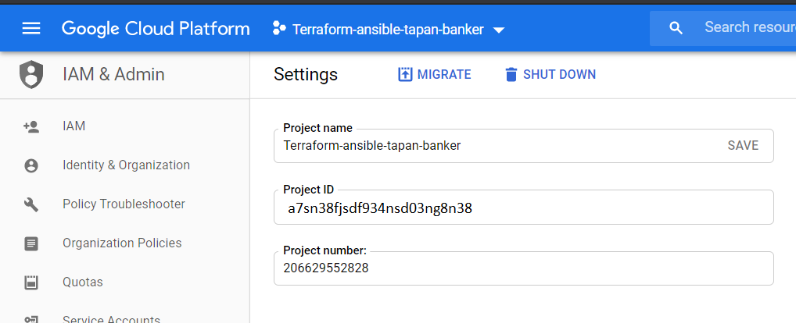
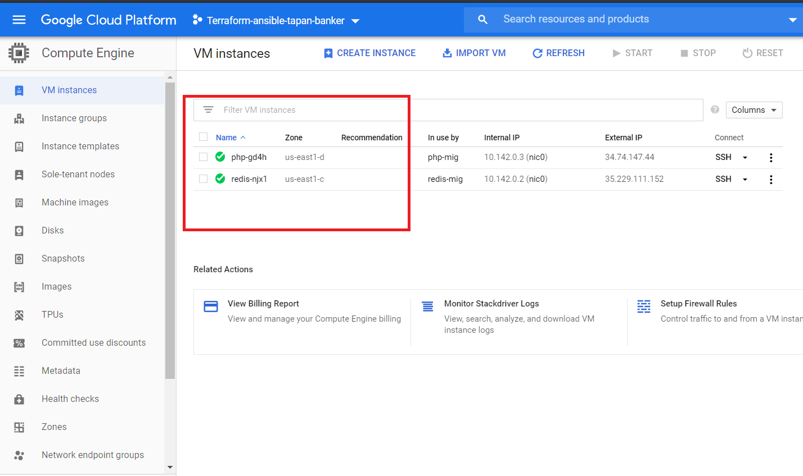

# Automation with Terraform, Ansible on Google Cloud Platform (GCP) 
-  Terraform and Anisble DevOps deployment
- Deploying Google GCP Virtual Network, Subnet, 2 GCP Instance with Google Load Balancer by Terraform. The Ansible with Terraform will install PHP, NGNIX and REDIS.


# Pre-requisite
- Install Terraform on the local machine https://www.terraform.io/downloads.html
- Create an free Google Cloud platform account (GCP) at URL https://console.cloud.google.com/
- In the Google Cloud platform GCP, go to IAM and Admin , Create a Sample Project and obtain the project-id
- On your local machine, install Google Cloud SDK (recommended for debugging purpose) URL https://cloud.google.com/sdk 
- Recommended to install Git Bash
- How to install Google Cloud SDK - https://cloud.google.com/sdk/docs/downloads-versioned-archives
 
 ## Create GCP a service account
- In the Cloud Console, go to the Create service account key page. Go to the Create Service Account Key page
- From the Service account list, select New service account. In the Service account name field, enter a name. From the Role list, select Project > Owner.
- Download the JSON file. Rename the JSON file as key.json and put in the project directory. 
- Use the following link - https://cloud.google.com/docs/authentication/production

# How to Execute
- Perform the Git clone 
 ```
cd terraform-ansible-gcp
 ```
- Update the terraform.tfvars file. Update the 'project_id' with the GCP Project ID
 
- Perform following commands to authenticate GCP. 
- Recommend to use us-east-1 region and us-east-1b as zone.
- Select the project and the email address.
 ```
 glcoud init 
 ```
 - Execute following Terraform commands
 
 ```
 terraform init
 terraform plan
 terraform apply
 ```
 
 - Wait for 3-4 minutes for the terraform and ansible to execute.
 - Check the Google Cloud Platform console.
 
 
 
# Technical Description

- The template is using Terraform with Ansible
- The Google Cloud Platform GCP resource type is used as provider. 
- There are local variable and also we are using data source, check the main.tf (google_project)
- The data source allow us to check if not exisit, or not. 
- The terraform templates creates 2 managed instance groups that can use autoscaling.
- The port 80 and 443 are open through the Google Load Balancer 
- The module for PHP, Redis, Google Load Balancer
- The Ansible Playbook will install the PHP and NGNIX in one GCP Compute Engine
- The Anisble Playbook will install Redis on another GCP Compute Engine.
- Nginx is exposed to Internet via google load balancer.
- The Ansible Playbook is triggered by Terraform using cloud-config
- The Anisble Playbook utilize Google Cloud Storage
- There are task in the Ansible playbook and marked with tags (Intall PHP, Install Apache, Start NGNIX, REDIS)
 - After login into the GCP Compute by SSH  execute following commands to verify the PHP, NGNIX and redis installation by Ansible
- On the PHP GCP Compute Engine

```
 php -v
 ngnix -v 
 ```
- On the Redis GCP Compute Engine

 ```
 redis-server --version
 ```
